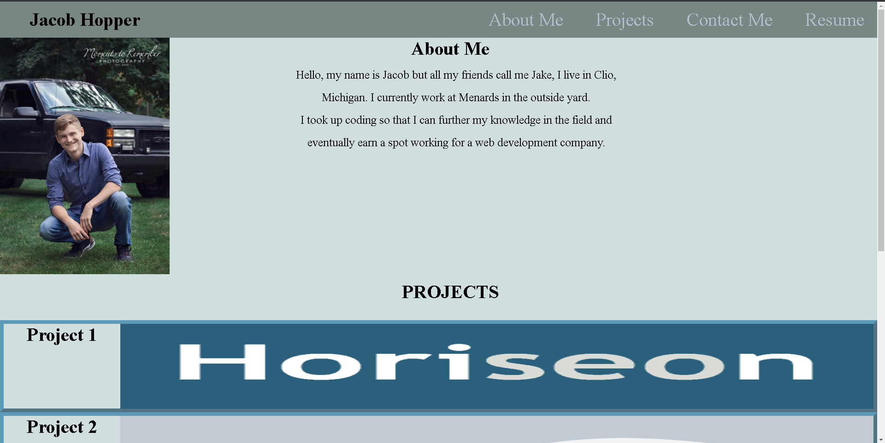

# portfolio-website

-I made this portfolio so that future employers can look at my projects so they can judge wheather my skills are up to par with what they would want in a employee.
-I wanted to showcase various things about my skills including the website page itself. In my portfolio-website employers can view various things including my phone number,GitHub,resume and my email address so they can contact me if they think my skills are up to par.

deployed url-https://juicyjake12.github.io/portfolio-website/

